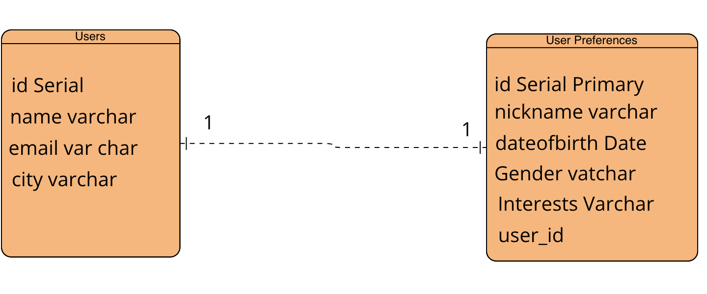

# RESTful API that allows you to manage Users and User preferences

This project built using Java and the following tools:

-Spring Boot as server side framework

-Maven as build automation tool

-Hibernate as ORM / JPA implementation

-Postgres as database implementation

-Spring Data JPA as the top layer over Hibernate

###Application Structure

####Domain

Domain model is organized under the Domain package and it consists of entity class. Entities use various annotations that describe the relationships between each other. All these annotations are used by JPA in order to map entities to database tables.

####DTO

In order to decouple the model/domain layer from the client side. only the needed data can be populated using DTO, instead of populating the entire model/domain. For small projects (like this), it is common for a DTO to be identical with the corresponding model. in order to implement a more scalableapplication DTOs are better approch.

####Repository

Repositories are interfaces that are responsible for data persistence and retrieval. The repository layer is an abstraction that provides all CRUD functionality and keeps hidden the data related information specific database implmentation from the other layers. This layer should always persist entities.

####Service

Service layer depends on the repository layer and provides separation of concern, encapsulating all the business logic implementation. It is there to apply business rules on data sent to and from the repository layer. Service layer does not care about the specific database implementation and provides loose coupling. This technique makes the application flexible in a possible data source replacement. This layer should always receive and return DTOs.

####Controller

Controller layer depends on the service layer and is responsible for the incoming requests and the outgoing responses. A controller determines all theavailable endpoints that client side (or other api) is able to call. This layer should not apply logic on the receiving or returning data.

#### User and User Preferences

In this app, Users primary details like name, email, phone, city are stored in a USERS table and Optional User Preferences are stored in  separate table called USERPREFERENCES, and they have a one-to-one relationship between USERS and USERPREFERENCES table.

The table looks like below.

####Quick Start

#####Prerequisites

######Clone the application
`https://github.com/ShekharaMathur/ShekharaMathur.git`

Create a Postgres database

CREATE Table <name>;

`CREATE TABLE users (
        id SERIAL PRIMARY KEY,
        name VARCHAR (50),
        email VARCHAR (50) NOT NULL UNIQUE,
        phone VARCHAR (50) NOT NULL UNIQUE,
	city  VARCHAR (50) NOT NULL
);`

######Change postgress username and password as per your installation

`open src/main/resources/application.properties`

change spring.datasource.username and spring.datasource.password as per your postgress installation

######Build and run the app using maven

Goto user folder then run the following

`./mvnw package`

`java -jar target/user-0.0.1-SNAPSHOT.jar`

######Alternatively, you can run the app without packaging it using -

`mvn spring-boot:run`

The server will start running at `http://localhost:8080`.

After running

#######Explore Rest APIs

The app defines following CRUD API's for User Creation

`GET /api/v1/users`

`POST /api/v1/users`

`GET /api/v1/users/{userId}`

`PUT /api/v1/users/{userId}`

`DELETE /api/v1/users/{userId}`

The following API's defines for User Preferences setting

`POST /api/v1/users/{id}/preferences`

`PUT /api/v1/users/{id}/updatepreferences`

`GET /api/v1/users/{id}/get-preferences`

